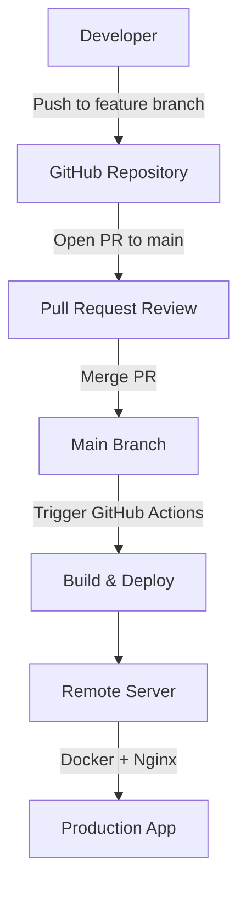
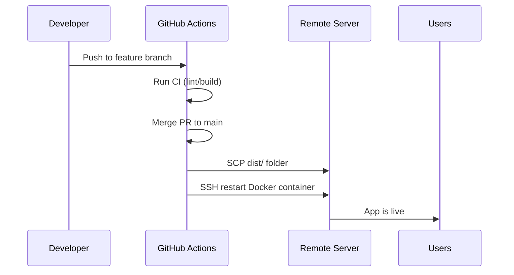

# OPEN SKY FLIGHT DATA ANALYTICS

A modern React application built with [Vite](https://vitejs.dev/) and TypeScript that serves as a frontend for the Open Sky Flight Data Analytics Backend. This repository includes an automated deployment pipeline using GitHub Actions to deploy the production build to a remote server with Docker + Nginx.

---

## Branch Protection

The `main` branch is **protected** to ensure stable deployments:

- Direct pushes to `main` are **not allowed**.
- Updates to `main` can only be made via **Pull Requests (PRs)**.
- PRs are reviewed and merged only after passing automated checks (like build verification).

This ensures the production app is always in a deployable state.

---

## Auto Deployment

The repository includes a GitHub Actions workflow that automatically deploys the app when the `main` branch is updated:

1. Push changes to a feature branch.
2. Open a Pull Request targeting `main`.
3. After review, merge the PR into `main`.
4. GitHub Actions triggers:
   - Installs dependencies (`npm ci`)
   - Builds the production app (`npm run build`)
   - Deploys the `dist/` folder to the remote server using SSH/SCP
   - Restarts the Nginx Docker container hosting the app

This process ensures zero-touch deployment for new updates.

---

## Deployment Diagram



---

## Installation

### Prerequisites

- Node.js 20+
- npm 9+
- Git

### Local Setup

1. Clone the repository:

```bash
git clone https://github.com/your-username/your-repo.git
cd your-repo
```

2. Install dependencies:

```bash
npm ci
```

3. Start development server:

```bash
npm run dev
```

4. Open the app in your browser at the URL shown in the terminal (usually `http://localhost:5173`).

### Build for Production

```bash
npm run build
```

This will create a `dist/` folder ready to be served by Nginx or any static server.

---

## Common Commands

| Command | Description |
|---------|-------------|
| `npm run dev` | Start the development server with hot-reloading. |
| `npm run build` | Build the app for production into `dist/`. |
| `npm run preview` | Preview the production build locally. |
| `npm run lint` | Run linter to check code style (if configured). |
| `git checkout -b feature/xxx` | Create a new feature branch. |
| `git push origin feature/xxx` | Push your feature branch to GitHub. |

---

## Deployment Notes

- The production app is served via **Docker + Nginx**.
- The GitHub Actions workflow handles:
  - Copying `dist/` to `/var/www/react-app/dist` on the server
  - Restarting the Docker container hosting the app
- Manual deployment can also be done by copying the `dist/` folder and restarting the container.

### Deployment Flow Diagram



---

## License

[MIT](LICENSE)

